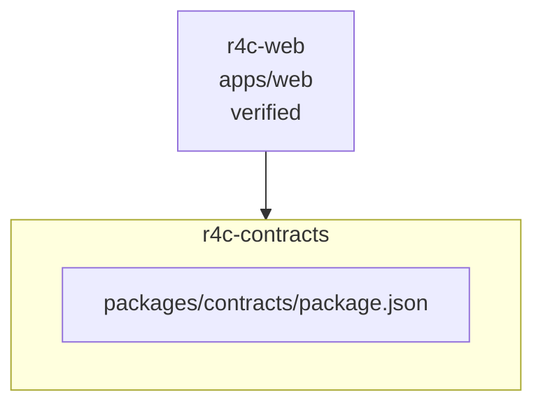

<!-- KAAF-GENERATED — do not edit by hand. Regenerate with scripts/architecture/generate.sh. -->

# Component — r4c-contracts (C4 L3)

`r4c-contracts` at `packages/contracts` — confidence `verified`. 1 declared public entry point(s), 0 dependency(ies), 1 dependent(s).

**Reading this diagram**

- Solid arrow: a dependency declared in a `kaaf.module.json` manifest.
- Dotted arrow: a real import discovered in the source that no manifest declares — see `.ai/drift.json`.
- Node outline reflects confidence: solid = `verified`, dashed = `documented` or `derived`.
<!-- kaaf:bodyDigest=0d2189c2b8a2f4d5dcc6023bed62812450765b04d2d2c4eccbd2a8b235a5106b -->
