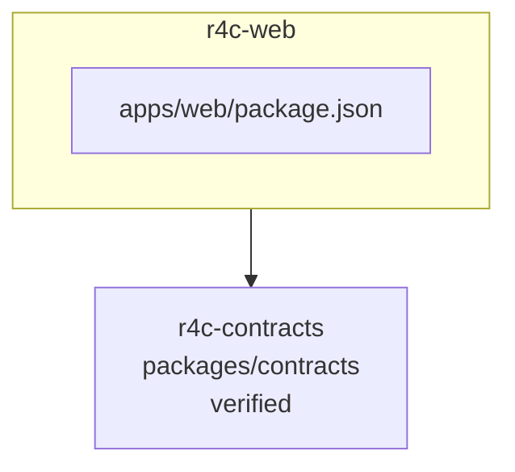

<!-- KAAF-GENERATED — do not edit by hand. Regenerate with scripts/architecture/generate.sh. -->

# Component — r4c-web (C4 L3)

`r4c-web` at `apps/web` — confidence `verified`. 1 declared public entry point(s), 1 dependency(ies), 0 dependent(s).

**Reading this diagram**

- Solid arrow: a dependency declared in a `kaaf.module.json` manifest.
- Dotted arrow: a real import discovered in the source that no manifest declares — see `.ai/drift.json`.
- Node outline reflects confidence: solid = `verified`, dashed = `documented` or `derived`.
<!-- kaaf:bodyDigest=5e7519d68747564bb637c6974525be7c1ef2c1c871d44c32439c26bac3c760e2 -->
