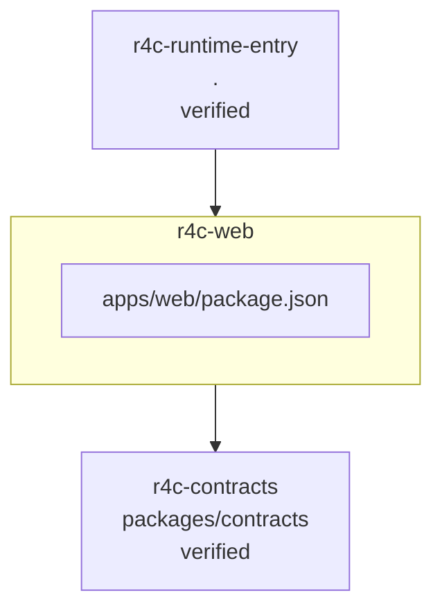

<!-- KAAF-GENERATED — do not edit by hand. Regenerate with scripts/architecture/generate.sh. -->

# Component — r4c-web (C4 L3)

`r4c-web` at `apps/web` — confidence `verified`. 1 declared public entry point(s), 1 dependency(ies), 1 dependent(s).

**Reading this diagram**

- Solid arrow: a dependency declared in a `kaaf.module.json` manifest.
- Dotted arrow: a real import discovered in the source that no manifest declares — see `.ai/drift.json`.
- Node outline reflects confidence: solid = `verified`, dashed = `documented` or `derived`.
<!-- kaaf:bodyDigest=d79ca1d11fe2b0e2f7ad6b9be6d7fbd21ec1b7bc8eec3a0a94a00a9dfbb97fde -->
