<!-- KAAF-GENERATED — do not edit by hand. Regenerate with scripts/architecture/generate.sh. -->

# Context (C4 L1)

What R4C is and what it depends on. 3 external integration(s).

```mermaid
graph TB
  R4C["R4C<br/>Islamce/R4C"]
  subgraph external[External systems]
    ext_Hostinger_SMTP["Hostinger SMTP<br/>email<br/>required"]
    ext_PostgreSQL_Prisma["PostgreSQL &#40;Prisma&#41;<br/>database<br/>required"]
    ext_R4C_API["R4C API<br/>api<br/>required"]
  end
  R4C -->|via r4c-api| ext_Hostinger_SMTP
  R4C -->|via r4c-api| ext_PostgreSQL_Prisma
  R4C -->|via r4c-web| ext_R4C_API
```

<!-- kaaf:bodyDigest=673d175631724679a3326f8015f32b95a28811dca65c6acd22691e6513e05eb4 -->
