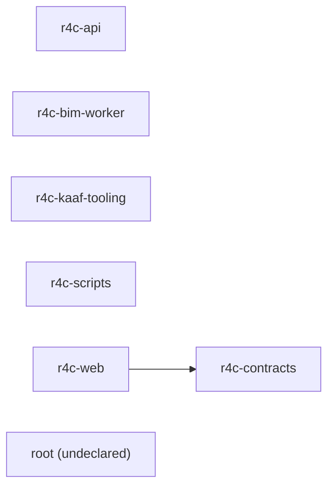

<!-- KAAF-GENERATED — do not edit by hand. Regenerate with scripts/architecture/generate.sh. -->

# R4C — Architecture Summary

R4C — a BIM-centered platform for governed real-estate development delivery, connecting projects, WBS, design documents, IFC models, approvals, progress and executive visibility.

- Repository: `Islamce/R4C`
- Default branch: `main`
- KAAF phase: 7
- Modules: 6 declared, 1 discovered only
- Drift: 0 error, 1 warning, 0 info
- Generator: `kaaf` v0.7.0
- Input digest: `5feb215d3f046d05…`

## Modules

Confidence is computed from evidence, not copied from the manifest: `verified` =
declared and corroborated by discovered code, `documented` = declared with no code to
check against, `derived` = discovered with no declaration.

| Module | Path | Owner | Purpose | Confidence |
|---|---|---|---|---|
| `r4c-api` | `apps/api` | Backend | Serve the governed R4C domain over HTTP: commercial inventory, projects, WBS, documents, approvals and progress. | `verified` |
| `r4c-bim-worker` | `apps/bim-worker` | Data | Extract geometry and metadata from IFC models so the platform can reason about them. | `verified` |
| `r4c-contracts` | `packages/contracts` | Backend | Define the typed contracts shared between the API and the web client. | `verified` |
| `r4c-kaaf-tooling` | `scripts/architecture` | DevOps | Generate and validate this repository's KAAF architecture context. | `verified` |
| `r4c-scripts` | `scripts` | DevOps | Provision local development environments and generate production configuration. | `verified` |
| `r4c-web` | `apps/web` | Frontend | Present the R4C platform to users, including commercial inventory, the IFC model viewer and executive dashboards. | `verified` |
| `root` | `.` | unknown | Not declared — discovered from source. | `derived` |

## Dependencies

Solid edges are declared in the manifests. Dotted edges were discovered from real
imports but are not declared — see the drift section below.

## Public contracts

No declared public contracts.

## Permissions

| Key | Module | Roles | Enforced at |
|---|---|---|---|
| `commercial:manage` | `r4c-api` | ADMIN | — |
| `commercial:read` | `r4c-api` | ADMIN, VIEWER | — |
| `commercial:status` | `r4c-api` | ADMIN | — |

## External integrations

| Integration | Module | Criticality | On unavailability |
|---|---|---|---|
| PostgreSQL (Prisma) | `r4c-api` | required | The API cannot serve or accept any domain data. |
| R4C API | `r4c-web` | required | The client renders but shows no project data. |

## Drift — declared versus discovered

0 error, 1 warning, 0 info. Errors block CI; warnings and information do not.

| Severity | Type | Module | Finding |
|---|---|---|---|
| `warning` | `undeclared-module` | `root` | 1 code file(s) under '.' belong to no declared module. |

Full detail, with evidence and recommendations, in `.ai/drift.json`.

## How to use this

1. Read `.ai/ai-context.json` for the module index and conventions.
2. Read this summary for orientation.
3. Read `.ai/modules/<id>.json` for the module your task touches.
4. Check `.ai/drift.json` before trusting a declaration.
5. Open only the source files those steps referenced.

Declarations come from `kaaf.repo.json` and `kaaf.module.json`. Discovery is a static
read of the source: dynamic imports and runtime wiring are invisible to it, so the
absence of a drift finding is not proof that none exists.
<!-- kaaf:bodyDigest=4b20a48157dd8158ec6ef41666456c56076d5695b5e4c574f53906928a111929 -->
