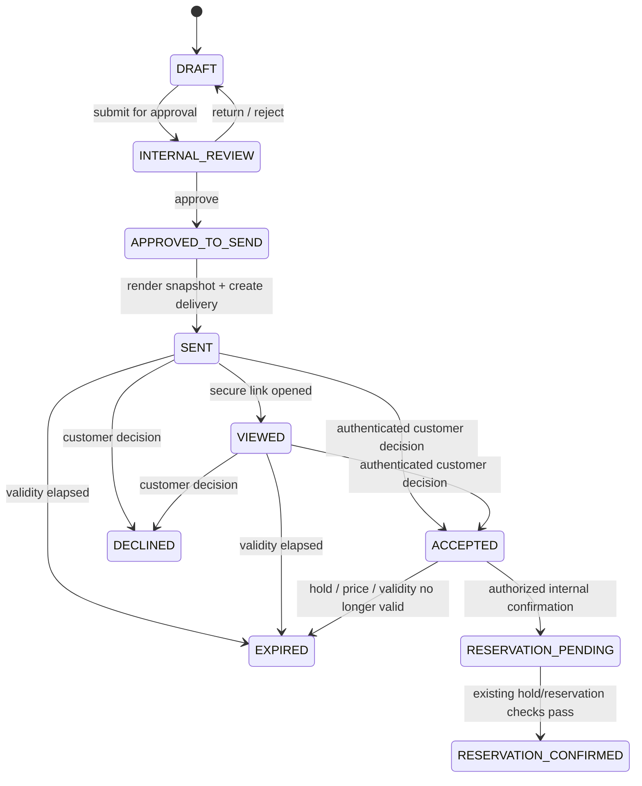
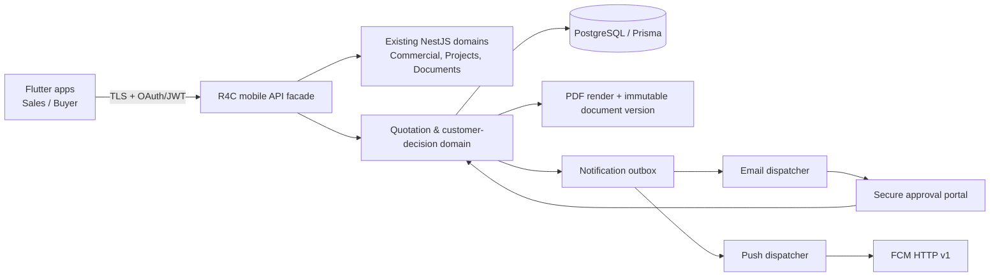

# R4C Quotation, Client Approval, RFQ, and Flutter Mobile Study

## Executive position

R4C has a strong foundation for a governed sales flow: tenant-scoped Customers, Leads, Unit Holds, Reservations, price revisions, payment plans, documents, audit events, and a notification outbox already exist. However, it **does not currently have an RFQ domain, a customer-facing quotation entity, a public approval link, a mobile client, or an active generic notification dispatcher**. The current email outbox use records intent to distribute an approved document, but the observed code does not yet dispatch that event to an external customer.

The recommended product capability is a **governed quotation lifecycle**, not an email attachment sent from a sales screen. A quotation should preserve the unit, payment plan, price revision, taxes/fees, commercial conditions, locale, expiry, immutable PDF snapshot, delivery attempts, recipient identity, and customer decision. A customer response should be treated as a commercial decision that can trigger an authorized reservation workflow; it must not directly create a sale or alter inventory without the existing hold/reservation controls.

## Current R4C foundations and gaps

| Existing foundation | Reuse in the proposed capability | Gap to close |
|---|---|---|
| Tenant-scoped `Customer`, `Lead`, `UnitHold`, and `Reservation` models | Links every quotation to a real customer, lead, project, unit, and canonical commercial price evidence. | Add `Quotation` and `QuotationLine` models rather than overloading Reservation. |
| Published price revision and payment-plan references in Reservation | Supplies server-side commercial values that can be frozen in a quotation snapshot. | Add snapshot fields for quotation amount, inclusions, exclusions, payment-plan terms, and validity date. |
| Document version, review, distribution, storage checksum, and audit patterns | Supports immutable PDF issuance and governed document provenance. | Add a quotation-specific render/attachment reference and customer-safe distribution record. |
| `AuditEvent` and `NotificationOutbox` | Captures business actions and queues delivery instructions. | Add recipient-contact delivery evidence, retry policy, provider response, and a dispatcher for customer email/push. |
| JWT login/refresh API | Enables a Flutter app to use the current identity and authorization model. | Add mobile device registration, secure token handling policy, and mobile-specific API endpoints. |
| Procurement orders and material takeoff | Provides a separate purchasing foundation. | There is no supplier/RFQ model; procurement RFQs need a distinct module and must not be merged with buyer quotations. |

## Domain separation

The word **RFQ** currently spans two materially different processes. These must be separate bounded domains to protect data and approvals.

| Domain | Primary actor | Purpose | Decision outcome |
|---|---|---|---|
| **Sales quotation** | Buyer/client and sales representative | Quote a development unit, price, payment plan, and commercial terms. | Customer accepts, declines, or requests clarification; an authorized internal user may then reserve/convert. |
| **Procurement RFQ** | Supplier/vendor and procurement team | Request supplier pricing and delivery terms for materials/services. | Internal commercial/procurement evaluation and purchase-order creation. |

The first release should implement **sales quotation and customer approval**. Procurement RFQ should be planned as a separate phase that builds on Material Takeoff, Material, WBS, and Procurement Order; it needs suppliers, RFQ invitations, bid submissions, commercial comparison, evaluator decisions, and purchase-order conversion.

## Governed sales quotation lifecycle

> **Approval meaning:** customer acceptance records commercial intent and the exact quoted snapshot. It does not itself issue a title deed, execute a regulated electronic signature, capture payment, reserve inventory, or create a binding sale. Those outcomes remain behind R4C’s existing authorized reservation, payment, and transfer controls. If the organization needs legally binding contract execution, legal counsel and a compliant electronic-signature process must define that separate scope.

### Required entities

| Entity | Key fields | Governance requirement |
|---|---|---|
| `Quotation` | tenant, lead, customer, project, unit, quote number, status, currency, locale, expires at, source price revision, payment plan, totals, rendered document version | Every relation tenant-scoped; quote numbers unique within tenant; immutable monetary snapshot after send. |
| `QuotationLine` | description, quantity, unit amount, total, tax/fee components, display order | Avoid recalculating customer-visible terms from later price changes. |
| `QuotationApprovalToken` | quotation ID, token hash, customer/recipient binding, expiry, consumed/revoked timestamps | Store a hash only; one-time or short-lived link; enforce rate limits and no enumerable IDs. |
| `QuotationDelivery` | channel, recipient contact snapshot, sent/opened/failed timestamps, provider message ID, last error | Records delivery evidence separately from customer decision. |
| `QuotationDecision` | accepted/declined/clarification, customer verification method, decision time, device/IP metadata where lawful, comment | Append-only event evidence; never overwrite a prior decision. |
| `MobileDevice` | tenant, user, platform, push token, active/revoked timestamps, app version | Supports targeted notifications and immediate revocation. |
| `Supplier`, `ProcurementRfq`, `RfqInvitation`, `SupplierBid` | Separate procurement-RFQ module | Do not ship in the sales-quotation release. |

### Permission model

| Permission | Capability |
|---|---|
| `commercial:quotation:create` | Build a draft from a lead, current unit availability, authorized price revision, and payment plan. |
| `commercial:quotation:review` | Approve a draft for customer delivery; cannot approve own draft when separation of duties is enabled. |
| `commercial:quotation:send` | Deliver an internally approved quotation using a configured channel. |
| `commercial:quotation:read` | Read tenant-scoped commercial quotation evidence. |
| `commercial:reservation:confirm` | Convert an accepted quotation only after server checks the hold, unit status, price revision, payment plan, and authorization. |
| `procurement:rfq:*` | Separate future supplier RFQ permissions. |

## Customer delivery and approval options

The delivery channel should be selected deliberately. Both options below use the same backend quotation records, customer verification, expiry, audit evidence, and reservation handoff.

| Approach | Customer experience and tradeoffs | Cost | Setup complexity |
|---|---|---:|---:|
| **Secure web approval link with transactional email** | The customer receives an email linking to a short-lived, customer-bound quotation portal. It is the fastest path, works without installing an app, and supports a bilingual PDF, approval summary, decline/clarification, and step-up verification. Delivery depends on a configured email provider and email deliverability. | Low-to-medium, driven by email provider volume. | Moderate: email provider, DNS/domain configuration, token security, OTP/verification policy, and public portal. |
| **Customer mobile app with push notification** | A signed-in buyer receives a push notification and opens the exact quotation in the app. It provides the strongest long-term experience for repeat buyers, status tracking, and document history, but requires user onboarding, store distribution, push credentials, and app support. | Medium, including mobile release and maintenance. | High: Android/iOS build and release, mobile device registration, push setup, customer authentication, and offline behavior. |
| **SMS/WhatsApp link notification** | A link reaches a customer quickly in a familiar channel, but requires a provider, opt-in/consent rules, delivery templates, delivery receipts, and an approved sender profile. It should be an additional notification channel rather than the source of truth for acceptance. | Provider and conversation/template costs. | High: vendor selection, consent and template governance, secrets, callbacks, delivery reconciliations, and webhook verification. |

The current R4C outbox has `EMAIL` and `IN_APP` channels but no observed generic sender worker. Therefore, the first implementation should build the **secure approval portal and email dispatcher together**, not expose a Send button that only creates an outbox row.

## Mobile-app study: Flutter for buyers and sales teams

Flutter is suitable for a shared Android/iOS mobile product because the R4C backend already exposes JWT login and refresh endpoints. Flutter’s current architecture guidance recommends deliberate separation of views, view models, repositories, and services for scalable feature-rich apps [1]. Flutter also supports deep links across iOS, Android, and web, allowing a quotation notification to open the corresponding in-app decision view [2].

Firebase Cloud Messaging is a viable mobile notification transport. Its Flutter documentation requires platform setup, device-registration token handling, token-refresh handling, and Apple Push Notification service configuration for iOS [3]. FCM HTTP v1 requests are authorized using application credentials or a service account and short-lived OAuth tokens; credentials must remain on the R4C server, never in Flutter [4].

### Recommended application boundaries

| Mobile audience | Primary mobile jobs | Data and safety boundaries |
|---|---|---|
| **Sales representative** | Browse active projects and inventory; capture customer interest; create leads; log calls/site visits; prepare draft quotations; track sent/viewed/accepted/expired state; initiate a hold request. | Can only see leads allowed by current `view-own` / `view-all` rules. Cannot silently alter price, approve their own quote, or directly create a sale. |
| **Sales manager / approver** | Review exceptions, approve send-ready quotations, monitor SLA, approve allowed discount exceptions, and authorize reservation conversion. | Separation of duties, tenant-scoped portfolio access, full decision evidence. |
| **Buyer/client** | View active project/unit interest, received quotations, payment-plan summary, quote PDF, expiry, clarification thread, and accept/decline decision. | Customer identity must be verified and bound to quotation recipient; sees only their own records, no tenant-wide data. |
| **Procurement user** | Future: create RFQ from material takeoff/WBS, invite suppliers, compare bids, and recommend award. | Separate domain and permissions from buyer quotations. |

### Mobile feature sequence

| Release | Flutter scope | Backend prerequisite |
|---|---|---|
| **M1 — Sales field companion** | Staff sign-in, project switcher, unit availability, lead capture, interest registration, activities, and governed progress of a lead. | A versioned `/mobile/v1` API layer that wraps existing tenant-scoped commercial contracts and returns minimal mobile DTOs. |
| **M2 — Quotation execution** | Draft quotation, review state, send status, deep-link opening, and manager decision. | Quotation domain, immutable pricing snapshots, review/send permissions, PDF renderer, email dispatcher, audit trail. |
| **M3 — Buyer self-service** | Customer sign-in/OTP, quotation inbox, view/accept/decline/clarify, document history, receipt. | Customer identity model, short-lived link/OTP verification, public decision endpoint, fraud/rate limits, decision evidence. |
| **M4 — Notifications and offline resilience** | Push registration, event notifications, deep links, limited encrypted offline read cache, retry queue for interest/activity drafts. | Device registry, FCM sender integration, idempotency keys, mobile sync endpoints, outbox worker. |
| **M5 — Procurement RFQ** | Procurement RFQ creation, supplier quote comparison, evaluator workflow. | New suppliers, RFQ, bid, and award domain; procurement-specific approvals. |

### Mobile technical architecture

The Flutter client should not call database/storage services directly, calculate authoritative commercial totals, or hold notification-provider credentials. It should store only refresh/session material in platform-secure storage, receive minimal tenant-scoped DTOs, and send idempotency keys for any action that may be retried on poor site connectivity.

## Recommended backend work packages

| Work package | Deliverables | Acceptance criteria |
|---|---|---|
| **Q1: quotation domain** | Prisma migration, statuses, line/snapshot models, price/payment-plan validation, audit events, DTOs, and tenant/permission tests. | A quote cannot use another tenant’s customer, lead, project, unit, price revision, or payment plan. Sent quotes are immutable. |
| **Q2: internal review and rendering** | Draft/review/approve transitions, separation of duties, bilingual PDF render, document-version linkage. | A non-approved quote cannot be delivered. PDF amount/terms match server snapshot. |
| **Q3: delivery and customer portal** | Email dispatcher, short-lived hashed token, customer verification, public read/decision endpoints, delivery and decision evidence. | A token cannot be replayed after decision/expiry and does not expose another customer’s quote. |
| **Q4: accepted-quote handoff** | Controlled prompt to create/confirm a hold/reservation under current commercial rules. | Customer acceptance never bypasses unit availability, hold expiry, price, payment plan, or human authorization. |
| **M1–M4: mobile** | Flutter codebase, mobile API facade, device registry, push, deep links, App Store/Play release controls, Arabic RTL QA. | Sales and buyer user journeys pass permission, tenant-isolation, RTL, offline/retry, and device-token revocation tests. |
| **P1: procurement RFQ** | Separate supplier/RFQ/bid/evaluation/award domain and UI. | Procurement RFQ data remains isolated from buyer quotations and can be converted only through an approved purchase-order workflow. |

## Decisions required before implementation

The product design can proceed without ambiguity once the following decisions are made.

1. **What customer-delivery channel is authorized first:** secure email approval link, customer mobile app notification, or both?
2. **What does “approval” mean commercially:** recorded acceptance of a quotation, authorization to create a hold, authorization to proceed to reservation, or a legally binding contract signature? These are different workflows.
3. **Which client identity method is acceptable:** email one-time passcode, Saudi mobile one-time passcode through an approved provider, existing customer account, or a combination?
4. **Should the first Flutter release serve internal sales only, or both sales and buyers?** Internal sales-first materially reduces public identity, consent, and app-store complexity.
5. **Does RFQ mean sales quotations to buyers, procurement RFQs to suppliers, or both?** The study treats them as separate modules.

## References

[1] [Flutter — Architecting Flutter apps](https://docs.flutter.dev/app-architecture)

[2] [Flutter — Deep linking](https://docs.flutter.dev/ui/navigation/deep-linking)

[3] [Firebase — Get started with Firebase Cloud Messaging in Flutter apps](https://firebase.google.com/docs/cloud-messaging/flutter/get-started)

[4] [Firebase — Send a message using the FCM HTTP v1 API](https://firebase.google.com/docs/cloud-messaging/send/v1-api)
